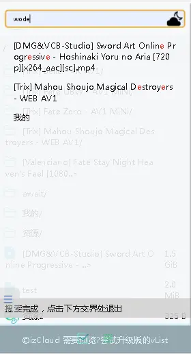

# vList
vList是一个基于nginx-fancyindex的列表程序，使用JS自动解析并使用aPlayer等JS模块在线打开文件预览
使用原生NGINX模块，因此理论上并发无可限量。
但是功能远比你想象中的强大，因为我们历经2个月的打磨，添加了很多aList都没有考虑到的功能

在preview文件夹有很多预览，此处放上几张主要的:

...

# 为什么

 - 如果你想要一个实用快速的本地网盘，可以自己添加/增删需要的功能，vList一定适合你
 - 支持简单的键盘及遥控器操作(目前支持预览)
 - 只需要NGINX fancyindex模块(image-filter与webdav可选)，没有并发担忧
 - 支持文件打包、设置、多种预览...且设置简单，开箱即用
 - 全面支持[剪切 复制 粘贴 新建 上传]，支持拖拽移动
 - 支持a-z排序，强大的全文模糊搜索，超大容量列表支持
 - 支持运行 autorun.py(注意是Python) 强大的虚拟化容器有效阻止危险脚本
 - ......

# 安装
很简单！1分钟即可搞定！[在这里看！](https://vlist.imzlh.top/docs/#/install.md)

# 文档
位于[临时站点](https://vlist.imzlh.top/docs/)，可以找到基础和进阶用法和无门槛安装方法
在module/文件夹有很多好用的模块，请自行前往文档站查询功能

2023 izGroup(C) MIT License